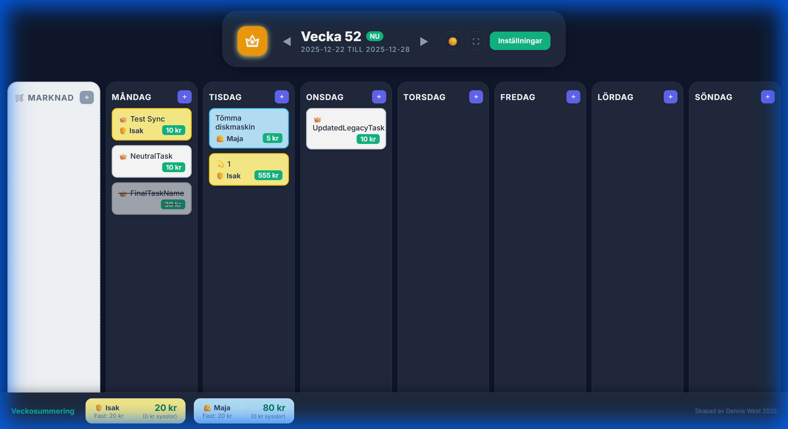
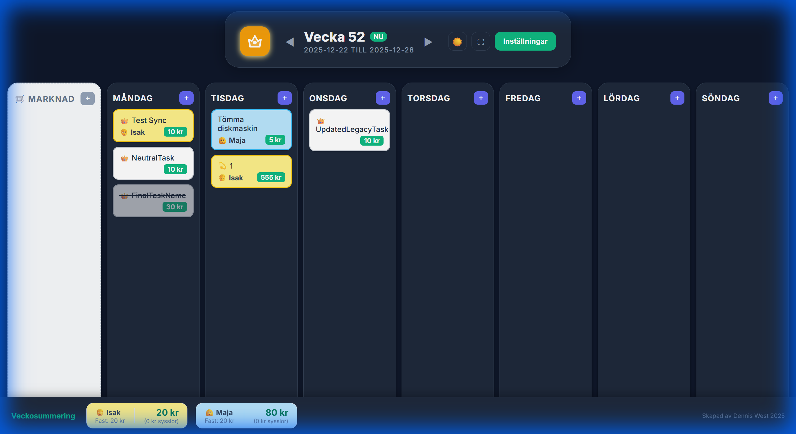
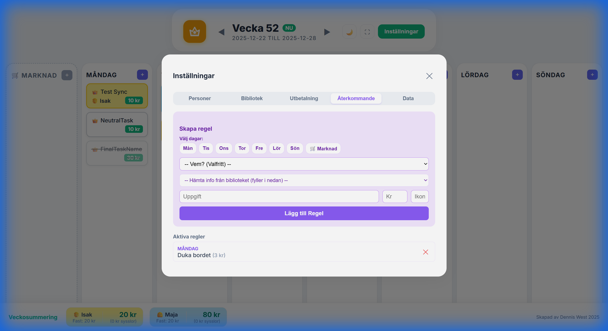
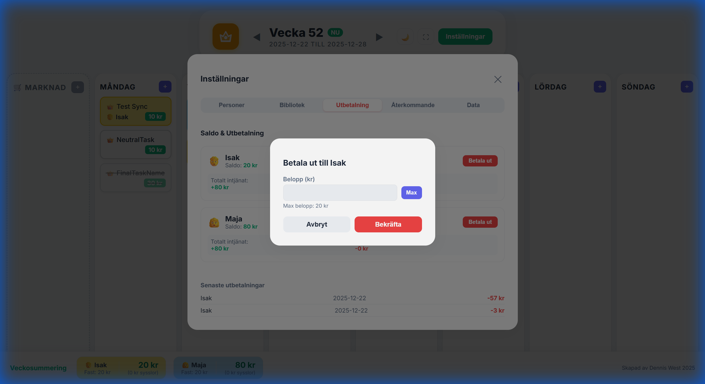

# Appen Kronan - Digital Veckoplanerare


## 📱 Översikt

Kronan är en modern, interaktiv digital veckoplanerare designad för hela familjen. Appen kombinerar veckoplanering med ett ekonomiskt belöningssystem och fungerar perfekt på alla enheter. Nu med stöd för Dark Mode, återkommande uppgifter och en marknad för lediga sysslor!


## 📸 Skärmbilder

### Översikt & Dark Mode
| Veckovy (Ljus) | Dark Mode |
| :---: | :---: |
|  |  |

### Inställningar
| Återkommande Regler | Utbetalning (Max-knapp) |
| :---: | :---: |
|  |  |

## ✨ Huvudfunktioner

### 📅 Veckoplanering
- **7-dagars vy** (Måndag - Söndag) med färgglada lappar
- **Dra och släpp** för att flytta eller kopiera uppgifter mellan dagar
- **Responsiv design** som anpassar sig till skärmbredden (mobil/surfplatta/desktop)

### 🛒 Marknad & Återkommande Sysslor (Nytt!)
- **Uppgiftsmarknad**: En kolumn för "Lediga" uppgifter som ingen ännu tagit på sig. Dra dem till din dag för att ta dem!
- **Återkommande regler**: Skapa regler för uppgifter som ska dyka upp varje vecka (t.ex. "Gå ut med soporna" varje tisdag).
  - Stöd för **flera dagar** (t.ex. Mån, Ons, Fre) i samma regel.
  - Kan riktas direkt till **Marknaden** för att låta vem som helst ta dem.

### 👥 Personhantering
- **Lägg till familjemedlemmar** med profilbilder (emojis)
- **Fast veckopeng** per person
- **Redigera personer** - namn, färg, veckopeng och ikon

### 💰 Ekonomiskt system
- **Tilldela värde** till varje uppgift (t.ex. "Tömma diskmaskin: 5 kr")
- **Automatisk summering** av veckopeng + intjänade pengar i realtid
- **Utbetalningssystem**: Registrera utbetalningar via en snygg modal.
  - **Max-knapp**: Fyll automatiskt i hela saldot med ett klick.
  - Historik över de senaste utbetalningarna.

### 🎨 Design & UX
- **Dark Mode**: Växla mellan ljust och mörkt tema via en knapp i headern.
- **Konfetti**: Fira när du slutför en uppgift! 🎉
- **Emojis**: Fullt stöd för hushålls-emojis som ikoner.
- **Inga scrollbars**: Helskärmsupplevelse utan störande lister.

---

## 🛠️ Teknisk information

### Teknologier
- **Lit** - Modern, lättviktig webkomponent-ramverk (laddas via CDN/ESM).
- **Vanilla JavaScript** - Inga byggsteg krävs, körs direkt i webbläsaren.
- **CSS Variables** - För enkel theming och Dark Mode.
- **LocalStorage & Home Assistant** - Dubbel datalagring för säkerhet och integration.

### Filstruktur
```
Kronan/
├── kronan-panel.js    # Huvudapplikation (Web Component logik)
├── kronan-lit.html    # HTML-entrypoint (laddar modulen)
└── readme.md          # Denna dokumentation
```

### Installation & Kom igång

#### 🖥️ Windows (Lokal användning)

För att appen ska fungera optimalt (och kunna ladda sina komponenter korrekt) rekommenderas att köra den via en lokal webbserver, då moderna webbläsare ibland blockerar funktioner när man öppnar HTML-filer direkt från hårddisken.

**Alternativ 1: Python (Enklast)**
1. Ladda ner alla filer till en mapp (t.ex. `Documents/Kronan`).
2. Högerklicka i mappen och välj "Öppna i Terminal" (eller cmd).
3. Skriv: `python -m http.server 8000`
4. Öppna din webbläsare och gå till: `http://localhost:8000/kronan-lit.html`

**Alternativ 2: VS Code**
1. Öppna mappen i Visual Studio Code.
2. Installera tillägget "Live Server".
3. Högerklicka på `kronan-lit.html` och välj "Open with Live Server".

**Alternativ 3: Direktöppning (Kan fungera)**
1. Högerklicka på `kronan-lit.html` -> Öppna med Edge/Chrome.
   *Notera: Om inget händer (blank sida), använd Alternativ 1 eller 2.*

#### 🏠 Home Assistant

Integrera Kronan som en del av din smarta hem-panel.

**Steg 1: Ladda upp filer**
1. Använd **File Editor**, **Samba Share** eller **VS Code Server** i Home Assistant.
2. Gå till mappen `/config/www/`.
3. Skapa en ny mapp som heter `kronan`.
4. Ladda upp `kronan-lit.html` och `kronan-panel.js` till denna mapp (`/config/www/kronan/`).

**Steg 2: Lägg till på Dashboard (Lovelace)**
1. Gå till din Dashboard -> Redigera Dashboard.
2. Välj **"Lägg till Kort"**.
3. Välj kortet **"Webbsida"** (Webpage Card).
4. I fältet **URL**, skriv: `/local/kronan/kronan-lit.html`
5. Ändra "Bildförhållande" (Aspect Ratio) vid behov för att passa din vy (t.ex. 100%).

*Tips: `/local/` i Home Assistant pekar automatiskt på `/config/www/` mappen.*

---

## 📖 Användarguide

### Grundläggande användning
1. **Lägg till personer** via Inställningar -> Personer.
2. **Skapa uppgifter** genom att klicka "+" på önskad dag eller i Marknaden.
3. **Dra uppgifter** mellan dagar eller till/från Marknaden.
4. **Markera klar**: Klicka på en uppgift för att stryka över den (och få konfetti!).

### Återkommande uppgifter
1. Gå till **Inställningar** -> **Återkommande**.
2. Välj dagar (t.ex. Mån, Fre) via knapparna.
3. Skriv in uppgift och värde.
4. Klicka "Lägg till". Uppgiften dyker nu upp automatiskt varje gång du byter vecka!

### Utbetalning
1. Gå till **Inställningar** -> **Utbetalning**.
2. Klicka på "Betala ut" vid en person.
3. Använd "Max"-knappen för att betala ut allt, eller skriv belopp.
4. Bekräfta. Saldot minskar och utbetalningen sparas i historiken.

---

## 👨‍💻 Skapare

**Appen Kronan** är skapad av **Dennis West 2025**

- 🎯 Syfte: Skapa en enkel men kraftfull veckoplanerare för familjer.
- 💡 Inspiration: Att göra hushållssysslor roligare och mer rättvisa.

## 📄 Licens

MIT License. Fri att använda och modifiera.